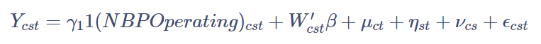
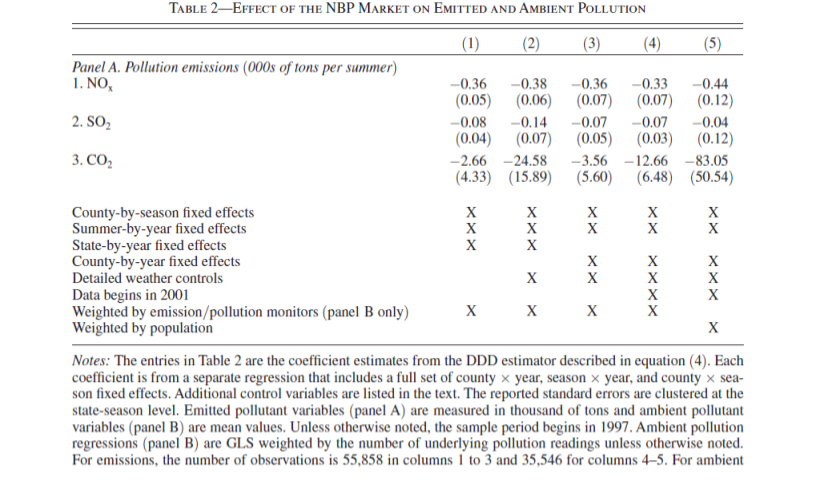

# Paper Replication Assignment 5: Make Table 2A

In this assignment, you will learn to understand, run, and interpret
regression results in Table 2 Panel A in *Defensive Investments and the
Demand for Air Quality: Evidence from the NOx Budget Program* by
Deschênes et al. (2017).

## **Part 1. Understanding the Methodology**

In the first part of this assignment, you will need to read **Section
IV. Econometric Model** (pages 2969 - 2970) in the paper by Deschênes et
al. (2017). You can find a copy of the paper in
[here](https://pubs.aeaweb.org/doi/pdfplus/10.1257/aer.20131002).
Afterward, you will need to answer the questions below.

We will focus on the regression equation



where $cst$ represents the unit of each observation in the data.

#### **Question 1: What is the unit of each observation in the data? (3 points)**

#### Answer: County, Season, Year

The variable $NBPOperating_{cst}$ is a product of three dummy variables,
$post_t \times nbp_c \times smm_s$.

$nbp_c$ is a dummy variable for NBP participating counties.

$smm_s$ is a dummy variable for the summer season.

#### **Question 2: What does the variable *post* represent? Why is *post* equal to 0.5 in the year 2003? (2 points)**

#### Answer: Post represents the implementation time of the NOx Budget Program. Because it started partway in 2003, Post is equal to 0.5 in that year.

#### **Question 3: What does the parameter of interest** $\gamma_1$ **represent? (1 point)**

#### Answer: It captures the impact of implementing the NOx Budget Program in regulated counties, relative to unregulated counties, in years when it operated relative to before, and in the summer relative to winter.

#### **Question 4: The variable** $\mu_{ct}$ **represents county-year fixed effects. Why do we have to include this factor in our analysis? (1 point)**

#### Answer: We need to take into account factors specific to a county in a year, such as local economic activity or healthcare provider quality.

#### **Question 5: The variable** $\eta_{st}$ **represents season-year fixed effects. Why do we have to include this factor in our analysis? (1 point)**

#### Answer: We need to take into account factors common to all areas in a season and year such as the development of a new drug that is sold in all areas.

#### **Question 6: The variable** $\nu_{cs}$ **represents county-season fixed effects. Why do we have to include this factor in our analysis? (1 point)**

#### Answer: To take into account other factors that can affect each county in the summer. For example, some counties have higher energy use from air conditioning in the summer.

## Part 2. Preparing the Data

Step 1: Declare that you will use the **tidyverse** and **lfe** package.
**(4 points)**

``` r
library("tidyverse")
library("lfe")
```

Step 2: Upload **data.csv** into the Environment. **(2 points)**

Note: This is the same dataframe that Deschenes et al. (2017) used to
run their regressions. It is download from the [replication package
released by the
authors](https://www.openicpsr.org/openicpsr/project/112938/version/V1/view).

``` r
df<-read.csv("data.csv")
```

Step 3: Create a new variable called **post** that is equal to 0.5 in
the year 2003 and equal to 1 in the years 2004 through 2007. Otherwise,
**post** is equal to 0. **(6 points)**

``` r
df2<-df %>%
  mutate(post=ifelse(year>=2004,1,0)) %>%
  mutate(post=ifelse(year==2003,0.5,post))
```

Step 4: The variable **fips** are county indicators. The script below
creates a unique identifier for each county-season which will be used to
represent $\nu_{cs}$ in the regressions.

You need to create another unique identifier for each season-year which
will be used to represent $\eta_{ct}$ in the regressions. Name the new
variable **smmXy**. **(2 points)**

``` r
df3<-df2 %>%
  mutate(smmXc = smm*as.numeric(fips)) %>%
  mutate(smmXy = smm*year)
```

Step 5: The script below creates a unique identifier for each state and
year. Use the same method to create a unique identifier for each
county-year. Name the new variable **cXy**. **(2 points)**

``` r
df4<-df3 %>%
  mutate(stXy = paste(state, "-", as.character(year))) %>%
  mutate(cXy = paste(fips, "-", as.character(year))) 
```

Step 6: Create a new variable that represents the variable
$NBPOperating_{cst}$. Name the new variable **NBPOperating**. **(3
points)**

Hint: We discussed this in Part 1 Question 1.

``` r
df5<-df4 %>%
  mutate(NBPOperating=post*smm*nbp) 
```

## Part 3: Running Regressions

Answer Questions 1 to 3 based on the regression results below.

``` r
summary(m1<-lm(nox_emit ~ NBPOperating, data=df5))
```


    Call:
    lm(formula = nox_emit ~ NBPOperating, data = df5)

    Residuals:
       Min     1Q Median     3Q    Max 
    -0.684 -0.684 -0.684 -0.614 67.859 

    Coefficients:
                 Estimate Std. Error t value Pr(>|t|)    
    (Intercept)   0.68390    0.01200  56.997  < 2e-16 ***
    NBPOperating -0.25771    0.03996  -6.449 1.13e-10 ***
    ---
    Signif. codes:  0 '***' 0.001 '**' 0.01 '*' 0.05 '.' 0.1 ' ' 1

    Residual standard error: 2.689 on 55856 degrees of freedom
    Multiple R-squared:  0.0007441, Adjusted R-squared:  0.0007262 
    F-statistic: 41.59 on 1 and 55856 DF,  p-value: 1.133e-10

#### **Question 1: According to the regression, the NOx Budget Program was able to reduce NOx emissions by 0.26 thousand tons per county-season. (1 point)**

#### **Question 2: According to the regression, the value of** $\gamma_1$ **is -0.26. (1 point)**

#### **Question 3: Can the regression produce an accurate estimate of the NBP’s impact? If not, why? (2 points)**

#### Answer: No, because there are other factors affecting NOx emissions that we have not taken into account.

The script below adds weather controls to the regression. Answer
Questions 4 to 6 based on the regression results below.

``` r
summary(m2<-felm(nox_emit ~ NBPOperating + 
                   dptp_xtile_1 + dptp_xtile_2 + dptp_xtile_4 + dptp_xtile_5 +
                   dptp_xtile_6 + dptp_xtile_7 + dptp_xtile_8 + dptp_xtile_9 +
                   dptp_xtile_10 + dptp_xtile_11 + dptp_xtile_12 + dptp_xtile_13 +
                   dptp_xtile_14 + dptp_xtile_15 + dptp_xtile_16 + dptp_xtile_17 +
                   dptp_xtile_18 + dptp_xtile_19 + dptp_xtile_20 + tmean_xtile_1 +
                   tmean_xtile_2 + tmean_xtile_4 + tmean_xtile_5 + tmean_xtile_6 +
                   tmean_xtile_7 + tmean_xtile_8 + tmean_xtile_9 + tmean_xtile_10 +
                   tmean_xtile_11 + tmean_xtile_12 + tmean_xtile_13 + 
                   tmean_xtile_14 + tmean_xtile_15 + tmean_xtile_16 + 
                   tmean_xtile_17 + tmean_xtile_18 +
                   tmean_xtile_19 + tmean_xtile_20 + mean_prcp, 
                 data=df5))
```


    Call:
       felm(formula = nox_emit ~ NBPOperating + dptp_xtile_1 + dptp_xtile_2 +      dptp_xtile_4 + dptp_xtile_5 + dptp_xtile_6 + dptp_xtile_7 +      dptp_xtile_8 + dptp_xtile_9 + dptp_xtile_10 + dptp_xtile_11 +      dptp_xtile_12 + dptp_xtile_13 + dptp_xtile_14 + dptp_xtile_15 +      dptp_xtile_16 + dptp_xtile_17 + dptp_xtile_18 + dptp_xtile_19 +      dptp_xtile_20 + tmean_xtile_1 + tmean_xtile_2 + tmean_xtile_4 +      tmean_xtile_5 + tmean_xtile_6 + tmean_xtile_7 + tmean_xtile_8 +      tmean_xtile_9 + tmean_xtile_10 + tmean_xtile_11 + tmean_xtile_12 +      tmean_xtile_13 + tmean_xtile_14 + tmean_xtile_15 + tmean_xtile_16 +      tmean_xtile_17 + tmean_xtile_18 + tmean_xtile_19 + tmean_xtile_20 +      mean_prcp, data = df5) 

    Residuals:
       Min     1Q Median     3Q    Max 
    -2.149 -0.765 -0.598 -0.393 67.769 

    Coefficients:
                    Estimate Std. Error t value Pr(>|t|)    
    (Intercept)     2.355626   0.808790   2.913 0.003587 ** 
    NBPOperating   -0.389795   0.045670  -8.535  < 2e-16 ***
    dptp_xtile_1    0.019680   0.004730   4.161 3.18e-05 ***
    dptp_xtile_2    0.002989   0.006131   0.487 0.625910    
    dptp_xtile_4    0.004247   0.006750   0.629 0.529227    
    dptp_xtile_5    0.017290   0.006101   2.834 0.004596 ** 
    dptp_xtile_6   -0.002370   0.005561  -0.426 0.669991    
    dptp_xtile_7    0.007099   0.005518   1.287 0.198228    
    dptp_xtile_8    0.002721   0.005544   0.491 0.623597    
    dptp_xtile_9   -0.006644   0.005339  -1.244 0.213345    
    dptp_xtile_10   0.005009   0.005351   0.936 0.349222    
    dptp_xtile_11   0.013290   0.005175   2.568 0.010227 *  
    dptp_xtile_12  -0.004723   0.005187  -0.911 0.362514    
    dptp_xtile_13   0.001993   0.005093   0.391 0.695502    
    dptp_xtile_14   0.003589   0.005065   0.709 0.478565    
    dptp_xtile_15  -0.001095   0.005074  -0.216 0.829204    
    dptp_xtile_16  -0.000923   0.005131  -0.180 0.857255    
    dptp_xtile_17  -0.005181   0.004980  -1.040 0.298135    
    dptp_xtile_18   0.012094   0.004794   2.523 0.011640 *  
    dptp_xtile_19  -0.005895   0.004468  -1.320 0.187003    
    dptp_xtile_20   0.007108   0.004150   1.713 0.086797 .  
    tmean_xtile_1  -0.033512   0.004364  -7.679 1.63e-14 ***
    tmean_xtile_2  -0.017020   0.006059  -2.809 0.004972 ** 
    tmean_xtile_4  -0.019786   0.006501  -3.044 0.002338 ** 
    tmean_xtile_5  -0.018127   0.005716  -3.171 0.001518 ** 
    tmean_xtile_6  -0.021451   0.005642  -3.802 0.000143 ***
    tmean_xtile_7  -0.024818   0.005563  -4.462 8.15e-06 ***
    tmean_xtile_8  -0.020789   0.005484  -3.791 0.000151 ***
    tmean_xtile_9  -0.011382   0.005521  -2.062 0.039253 *  
    tmean_xtile_10 -0.019434   0.005373  -3.617 0.000298 ***
    tmean_xtile_11 -0.017368   0.005234  -3.318 0.000907 ***
    tmean_xtile_12 -0.012080   0.005154  -2.344 0.019104 *  
    tmean_xtile_13 -0.023391   0.005061  -4.622 3.81e-06 ***
    tmean_xtile_14 -0.013188   0.004998  -2.639 0.008327 ** 
    tmean_xtile_15 -0.009385   0.004920  -1.907 0.056467 .  
    tmean_xtile_16 -0.008688   0.004848  -1.792 0.073114 .  
    tmean_xtile_17 -0.013971   0.004772  -2.928 0.003417 ** 
    tmean_xtile_18 -0.016470   0.004600  -3.580 0.000344 ***
    tmean_xtile_19 -0.016644   0.004248  -3.918 8.95e-05 ***
    tmean_xtile_20 -0.015726   0.003935  -3.997 6.43e-05 ***
    mean_prcp       0.033513   0.003447   9.723  < 2e-16 ***
    ---
    Signif. codes:  0 '***' 0.001 '**' 0.01 '*' 0.05 '.' 0.1 ' ' 1

    Residual standard error: 2.68 on 55817 degrees of freedom
    Multiple R-squared(full model): 0.007895   Adjusted R-squared: 0.007184 
    Multiple R-squared(proj model): 0.007895   Adjusted R-squared: 0.007184 
    F-statistic(full model): 11.1 on 40 and 55817 DF, p-value: < 2.2e-16 
    F-statistic(proj model):  11.1 on 40 and 55817 DF, p-value: < 2.2e-16 

#### **Question 4: According to the regression, the NOx Budget Program was able to reduce NOx emissions by 0.39\_ thousand tons per county-season. (1 point)**

#### **Question 5: According to the regression, the value of** $\gamma_1$ **is -0.39. (1 point)**

The part below replicates regression results in the paper by Deschênes
et al. (2017).



### Column 1

The following regression will replicate the results in Table 2 Panel A
Column 1. Because multiple fixed effects will be included, we will use
the function *felm* instead of *lm*. Answer Questions 6 and 7 based on
the regression results below.

``` r
summary(c1<-felm(nox_emit ~ NBPOperating | 
                   smmXc + smmXy + stXy , 
                 data=df5))
```

#### **Question 6: According to the regression, the NOx Budget Program was able to reduce NOx emissions by 0.36 thousand tons per county-season. (1 point)**

#### **Question 7: What fixed effects were included in the regression? (3 point)**

#### Answer: season-county, season-year, state-year

### Column 2

The following regression will replicate the results in Table 2 Panel A
Column 1. Modify the script below to replicate the results in Column 2.
**(3 points)**

``` r
summary(c2<-felm(nox_emit ~ NBPOperating + 
                   dptp_xtile_1 + dptp_xtile_2 + dptp_xtile_4 + dptp_xtile_5 +
                   dptp_xtile_6 + dptp_xtile_7 + dptp_xtile_8 + dptp_xtile_9 +
                   dptp_xtile_10 + dptp_xtile_11 + dptp_xtile_12 + dptp_xtile_13 +
                   dptp_xtile_14 + dptp_xtile_15 + dptp_xtile_16 + dptp_xtile_17 +
                   dptp_xtile_18 + dptp_xtile_19 + dptp_xtile_20 + tmean_xtile_1 +
                   tmean_xtile_2 + tmean_xtile_4 + tmean_xtile_5 + tmean_xtile_6 +
                   tmean_xtile_7 + tmean_xtile_8 + tmean_xtile_9 + tmean_xtile_10 +
                   tmean_xtile_11 + tmean_xtile_12 + tmean_xtile_13 +
                   tmean_xtile_14 + tmean_xtile_15 + tmean_xtile_16 +
                   tmean_xtile_17 + tmean_xtile_18 +
                   tmean_xtile_19 + tmean_xtile_20 + mean_prcp | 
                   smmXc + smmXy + stXy , 
                 data=df5))
```


    Call:
       felm(formula = nox_emit ~ NBPOperating + dptp_xtile_1 + dptp_xtile_2 +      dptp_xtile_4 + dptp_xtile_5 + dptp_xtile_6 + dptp_xtile_7 +      dptp_xtile_8 + dptp_xtile_9 + dptp_xtile_10 + dptp_xtile_11 +      dptp_xtile_12 + dptp_xtile_13 + dptp_xtile_14 + dptp_xtile_15 +      dptp_xtile_16 + dptp_xtile_17 + dptp_xtile_18 + dptp_xtile_19 +      dptp_xtile_20 + tmean_xtile_1 + tmean_xtile_2 + tmean_xtile_4 +      tmean_xtile_5 + tmean_xtile_6 + tmean_xtile_7 + tmean_xtile_8 +      tmean_xtile_9 + tmean_xtile_10 + tmean_xtile_11 + tmean_xtile_12 +      tmean_xtile_13 + tmean_xtile_14 + tmean_xtile_15 + tmean_xtile_16 +      tmean_xtile_17 + tmean_xtile_18 + tmean_xtile_19 + tmean_xtile_20 +      mean_prcp | smmXc + smmXy + stXy, data = df5) 

    Residuals:
        Min      1Q  Median      3Q     Max 
    -19.979  -0.516  -0.149   0.067  66.528 

    Coefficients:
                     Estimate Std. Error t value Pr(>|t|)    
    NBPOperating   -0.3819562  0.0795996  -4.798 1.60e-06 ***
    dptp_xtile_1    0.0194319  0.0041890   4.639 3.51e-06 ***
    dptp_xtile_2    0.0019856  0.0054027   0.368  0.71323    
    dptp_xtile_4   -0.0033269  0.0058366  -0.570  0.56868    
    dptp_xtile_5    0.0067366  0.0053055   1.270  0.20419    
    dptp_xtile_6   -0.0044259  0.0048392  -0.915  0.36041    
    dptp_xtile_7    0.0026135  0.0048388   0.540  0.58911    
    dptp_xtile_8    0.0009004  0.0048340   0.186  0.85223    
    dptp_xtile_9   -0.0036354  0.0047251  -0.769  0.44167    
    dptp_xtile_10   0.0024884  0.0047439   0.525  0.59990    
    dptp_xtile_11   0.0074019  0.0046100   1.606  0.10836    
    dptp_xtile_12  -0.0020077  0.0045830  -0.438  0.66133    
    dptp_xtile_13   0.0065364  0.0045892   1.424  0.15437    
    dptp_xtile_14   0.0059410  0.0045485   1.306  0.19151    
    dptp_xtile_15   0.0015106  0.0045315   0.333  0.73886    
    dptp_xtile_16   0.0047410  0.0046721   1.015  0.31023    
    dptp_xtile_17   0.0048105  0.0045838   1.049  0.29397    
    dptp_xtile_18   0.0043569  0.0044799   0.973  0.33078    
    dptp_xtile_19   0.0054734  0.0042471   1.289  0.19750    
    dptp_xtile_20   0.0060056  0.0040340   1.489  0.13656    
    tmean_xtile_1  -0.0342836  0.0040583  -8.448  < 2e-16 ***
    tmean_xtile_2  -0.0159297  0.0052595  -3.029  0.00246 ** 
    tmean_xtile_4  -0.0143178  0.0054422  -2.631  0.00852 ** 
    tmean_xtile_5  -0.0037880  0.0049329  -0.768  0.44254    
    tmean_xtile_6  -0.0038119  0.0048540  -0.785  0.43228    
    tmean_xtile_7  -0.0116120  0.0048314  -2.403  0.01625 *  
    tmean_xtile_8  -0.0081784  0.0048059  -1.702  0.08881 .  
    tmean_xtile_9  -0.0028494  0.0048818  -0.584  0.55944    
    tmean_xtile_10 -0.0083946  0.0047736  -1.759  0.07866 .  
    tmean_xtile_11 -0.0085006  0.0046713  -1.820  0.06880 .  
    tmean_xtile_12 -0.0050861  0.0046750  -1.088  0.27663    
    tmean_xtile_13 -0.0075987  0.0045792  -1.659  0.09705 .  
    tmean_xtile_14 -0.0056173  0.0045513  -1.234  0.21714    
    tmean_xtile_15 -0.0074377  0.0045080  -1.650  0.09897 .  
    tmean_xtile_16 -0.0063805  0.0044818  -1.424  0.15455    
    tmean_xtile_17 -0.0063848  0.0044516  -1.434  0.15151    
    tmean_xtile_18 -0.0031777  0.0044733  -0.710  0.47748    
    tmean_xtile_19 -0.0086109  0.0044154  -1.950  0.05116 .  
    tmean_xtile_20 -0.0063149  0.0041912  -1.507  0.13190    
    mean_prcp       0.0054505  0.0040701   1.339  0.18052    
    ---
    Signif. codes:  0 '***' 0.001 '**' 0.01 '*' 0.05 '.' 0.1 ' ' 1

    Residual standard error: 2.13 on 52818 degrees of freedom
    Multiple R-squared(full model): 0.4069   Adjusted R-squared: 0.3727 
    Multiple R-squared(proj model): 0.004534   Adjusted R-squared: -0.05274 
    F-statistic(full model):11.92 on 3039 and 52818 DF, p-value: < 2.2e-16 
    F-statistic(proj model): 6.014 on 40 and 52818 DF, p-value: < 2.2e-16 
    *** Standard errors may be too high due to more than 2 groups and exactDOF=FALSE

### Column 3

The following regression will replicate the results in Table 2 Panel A
Column 5. Modify the script below to replicate the results in column 3.
**(3 points)**

``` r
summary(c3<-felm(nox_emit ~ NBPOperating + 
                   dptp_xtile_1 + dptp_xtile_2 + dptp_xtile_4 + dptp_xtile_5 +
                   dptp_xtile_6 + dptp_xtile_7 + dptp_xtile_8 + dptp_xtile_9 +
                   dptp_xtile_10 + dptp_xtile_11 + dptp_xtile_12 + dptp_xtile_13 +
                   dptp_xtile_14 + dptp_xtile_15 + dptp_xtile_16 + dptp_xtile_17 +
                   dptp_xtile_18 + dptp_xtile_19 + dptp_xtile_20 + tmean_xtile_1 +
                   tmean_xtile_2 + tmean_xtile_4 + tmean_xtile_5 + tmean_xtile_6 +
                   tmean_xtile_7 + tmean_xtile_8 + tmean_xtile_9 + tmean_xtile_10 +
                   tmean_xtile_11 + tmean_xtile_12 + tmean_xtile_13 + 
                   tmean_xtile_14 + tmean_xtile_15 + tmean_xtile_16 + 
                   tmean_xtile_17 + tmean_xtile_18 +
                   tmean_xtile_19 + tmean_xtile_20 + mean_prcp | 
                   smmXc + smmXy + cXy, 
                 data=df5))
```


    Call:
       felm(formula = nox_emit ~ NBPOperating + dptp_xtile_1 + dptp_xtile_2 +      dptp_xtile_4 + dptp_xtile_5 + dptp_xtile_6 + dptp_xtile_7 +      dptp_xtile_8 + dptp_xtile_9 + dptp_xtile_10 + dptp_xtile_11 +      dptp_xtile_12 + dptp_xtile_13 + dptp_xtile_14 + dptp_xtile_15 +      dptp_xtile_16 + dptp_xtile_17 + dptp_xtile_18 + dptp_xtile_19 +      dptp_xtile_20 + tmean_xtile_1 + tmean_xtile_2 + tmean_xtile_4 +      tmean_xtile_5 + tmean_xtile_6 + tmean_xtile_7 + tmean_xtile_8 +      tmean_xtile_9 + tmean_xtile_10 + tmean_xtile_11 + tmean_xtile_12 +      tmean_xtile_13 + tmean_xtile_14 + tmean_xtile_15 + tmean_xtile_16 +      tmean_xtile_17 + tmean_xtile_18 + tmean_xtile_19 + tmean_xtile_20 +      mean_prcp | smmXc + smmXy + cXy, data = df5) 

    Residuals:
         Min       1Q   Median       3Q      Max 
    -11.7606  -0.0474   0.0000   0.0474  11.7606 

    Coefficients:
                     Estimate Std. Error t value Pr(>|t|)    
    NBPOperating   -3.578e-01  2.112e-02 -16.939   <2e-16 ***
    dptp_xtile_1   -3.206e-03  1.641e-03  -1.954   0.0508 .  
    dptp_xtile_2   -1.523e-03  1.932e-03  -0.789   0.4303    
    dptp_xtile_4   -9.294e-04  2.117e-03  -0.439   0.6606    
    dptp_xtile_5   -5.186e-04  1.896e-03  -0.274   0.7844    
    dptp_xtile_6   -2.713e-03  1.747e-03  -1.553   0.1205    
    dptp_xtile_7   -3.888e-03  1.776e-03  -2.189   0.0286 *  
    dptp_xtile_8   -2.137e-05  1.793e-03  -0.012   0.9905    
    dptp_xtile_9   -1.666e-03  1.766e-03  -0.943   0.3455    
    dptp_xtile_10  -3.390e-03  1.765e-03  -1.921   0.0548 .  
    dptp_xtile_11  -1.870e-03  1.712e-03  -1.093   0.2746    
    dptp_xtile_12  -1.939e-03  1.723e-03  -1.125   0.2606    
    dptp_xtile_13  -1.960e-03  1.718e-03  -1.141   0.2541    
    dptp_xtile_14  -1.946e-03  1.718e-03  -1.133   0.2574    
    dptp_xtile_15  -3.934e-03  1.710e-03  -2.301   0.0214 *  
    dptp_xtile_16  -2.413e-03  1.770e-03  -1.363   0.1729    
    dptp_xtile_17  -2.041e-03  1.774e-03  -1.150   0.2500    
    dptp_xtile_18  -2.020e-03  1.747e-03  -1.157   0.2474    
    dptp_xtile_19  -2.299e-03  1.688e-03  -1.362   0.1733    
    dptp_xtile_20  -1.988e-03  1.674e-03  -1.187   0.2351    
    tmean_xtile_1   1.024e-04  1.638e-03   0.063   0.9501    
    tmean_xtile_2   9.135e-04  1.870e-03   0.489   0.6252    
    tmean_xtile_4  -3.960e-05  1.974e-03  -0.020   0.9840    
    tmean_xtile_5  -8.316e-04  1.816e-03  -0.458   0.6470    
    tmean_xtile_6   1.094e-03  1.873e-03   0.584   0.5591    
    tmean_xtile_7   4.645e-05  1.907e-03   0.024   0.9806    
    tmean_xtile_8   9.852e-04  1.924e-03   0.512   0.6086    
    tmean_xtile_9   2.667e-03  1.994e-03   1.338   0.1810    
    tmean_xtile_10 -1.643e-03  2.044e-03  -0.804   0.4214    
    tmean_xtile_11  8.238e-04  2.045e-03   0.403   0.6870    
    tmean_xtile_12  2.722e-03  2.102e-03   1.295   0.1954    
    tmean_xtile_13 -1.180e-03  2.062e-03  -0.572   0.5672    
    tmean_xtile_14 -4.613e-04  2.059e-03  -0.224   0.8228    
    tmean_xtile_15  1.741e-03  2.070e-03   0.841   0.4003    
    tmean_xtile_16 -2.222e-04  2.107e-03  -0.105   0.9160    
    tmean_xtile_17  1.093e-03  2.119e-03   0.516   0.6058    
    tmean_xtile_18  1.439e-03  2.129e-03   0.676   0.4992    
    tmean_xtile_19  3.382e-04  2.101e-03   0.161   0.8721    
    tmean_xtile_20  1.501e-03  2.133e-03   0.704   0.4817    
    mean_prcp      -2.101e-03  1.652e-03  -1.272   0.2034    
    ---
    Signif. codes:  0 '***' 0.001 '**' 0.01 '*' 0.05 '.' 0.1 ' ' 1

    Residual standard error: 0.5422 on 25340 degrees of freedom
    Multiple R-squared(full model): 0.9816   Adjusted R-squared: 0.9594 
    Multiple R-squared(proj model): 0.01482   Adjusted R-squared: -1.172 
    F-statistic(full model):44.21 on 30517 and 25340 DF, p-value: < 2.2e-16 
    F-statistic(proj model): 9.529 on 40 and 25340 DF, p-value: < 2.2e-16 
    *** Standard errors may be too high due to more than 2 groups and exactDOF=FALSE

### Column 4

The following regression will replicate the results in Table 2 Panel A
Column 5. Modify the script below to replicate the results in column 4.
**(3 points)**

``` r
df2001<-df5 %>%
  filter(year>=2001)

summary(c4<-felm(nox_emit ~ NBPOperating + 
                   dptp_xtile_1 + dptp_xtile_2 + dptp_xtile_4 + dptp_xtile_5 +
                   dptp_xtile_6 + dptp_xtile_7 + dptp_xtile_8 + dptp_xtile_9 +
                   dptp_xtile_10 + dptp_xtile_11 + dptp_xtile_12 + dptp_xtile_13 +
                   dptp_xtile_14 + dptp_xtile_15 + dptp_xtile_16 + dptp_xtile_17 +
                   dptp_xtile_18 + dptp_xtile_19 + dptp_xtile_20 + tmean_xtile_1 +
                   tmean_xtile_2 + tmean_xtile_4 + tmean_xtile_5 + tmean_xtile_6 +
                   tmean_xtile_7 + tmean_xtile_8 + tmean_xtile_9 + tmean_xtile_10 +
                   tmean_xtile_11 + tmean_xtile_12 + tmean_xtile_13 + 
                   tmean_xtile_14 + tmean_xtile_15 + tmean_xtile_16 + 
                   tmean_xtile_17 + tmean_xtile_18 +
                   tmean_xtile_19 + tmean_xtile_20 + mean_prcp | 
                   smmXc + smmXy + cXy, 
                 data=df2001))
```

### Column 5

You just have to run the script below.

``` r
df2001<-df5 %>%
  filter(year>=2001)

summary(c5<-felm(nox_emit ~ NBPOperating + 
                   dptp_xtile_1 + dptp_xtile_2 + dptp_xtile_4 + dptp_xtile_5 +
                   dptp_xtile_6 + dptp_xtile_7 + dptp_xtile_8 + dptp_xtile_9 +
                   dptp_xtile_10 + dptp_xtile_11 + dptp_xtile_12 + dptp_xtile_13 +
                   dptp_xtile_14 + dptp_xtile_15 + dptp_xtile_16 + dptp_xtile_17 +
                   dptp_xtile_18 + dptp_xtile_19 + dptp_xtile_20 + tmean_xtile_1 +
                   tmean_xtile_2 + tmean_xtile_4 + tmean_xtile_5 + tmean_xtile_6 +
                   tmean_xtile_7 + tmean_xtile_8 + tmean_xtile_9 + tmean_xtile_10 +
                   tmean_xtile_11 + tmean_xtile_12 + tmean_xtile_13 + 
                   tmean_xtile_14 + tmean_xtile_15 + tmean_xtile_16 + 
                   tmean_xtile_17 + tmean_xtile_18 +
                   tmean_xtile_19 + tmean_xtile_20 + mean_prcp | 
                   smmXc + smmXy + cXy, 
                 weights = df2001$pop_all,
                 data=df2001))

res_tab<-as.data.frame(cbind(C1 = coef(c1)[[1]], 
                             C2 = coef(c2)[[1]], 
                             C3 = coef(c3)[[1]], 
                             C4 = coef(c4)[[1]], 
                             C5 = coef(c5)[[1]]))
library("knitr")
kable(res_tab, digits=2)
```

#### **Question 8: Based on the regression results in Column 1 through 5, the NOx Budget Program decreased NOx emissions in the average county by 330 (minimum value) to 440 (maximum value) tons of NOx per summer. (2 points)**

#### **Question 9: Because there are 1185 counties regulated by the NOx Budget Program, our results correspond to a total decrease of between 391,050 (minimum value) to 521,400 (maximum value) tons of NOx per summer. (4 points)**

Remove all lines of script with **\#\| eval: false** which prevents the
line from running when rendered. Afterward, click Render to generate an
html file of this document. Click **Render** to generate an html file of
this document.

You have reached the end of the assignment. Render the Quarto document
and push the completed assignment back into the GitHub repository. **(2
points)**
